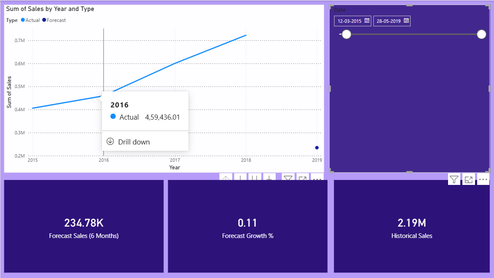
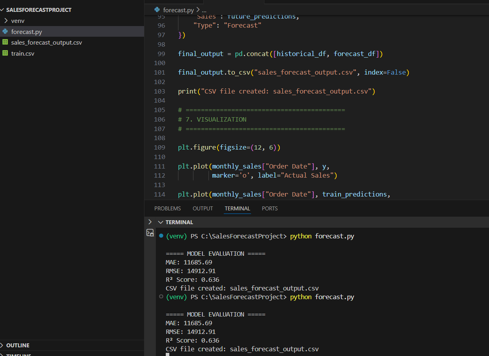

# 🚀 FUTURE_ML_01  
## Sales Forecasting Using Machine Learning & Power BI

---

## 📌 Project Overview

This project builds a Sales Forecasting System using historical retail data to predict future demand and support business decision-making.

The workflow includes:

- Data cleaning and preprocessing
- Feature engineering (trend & seasonality)
- Regression-based forecasting model
- Performance evaluation (MAE, RMSE, R²)
- Interactive Power BI dashboard for visualization

---

## 🛠 Tech Stack

- Python  
- Pandas  
- NumPy  
- Scikit-learn  
- Matplotlib  
- Power BI  

---

## 📊 Model Performance

- R² Score: 0.63  
- MAE & RMSE calculated for evaluation  

The model predicts approximately **11% growth over the next 6 months**, helping businesses:

- Plan inventory efficiently  
- Optimize staffing  
- Improve cash flow  
- Reduce overstocking risks  

---

## 📂 Project Files

- forecast.py → Model implementation  
- train.csv → Training dataset  
- sales_forecast_output.csv → Predicted results  
- images/ → Screenshots & dashboard visuals  

---

## 📊 Dashboard Preview

## 📈 Model Output

---

## ▶ How to Run

1. Install dependencies:
